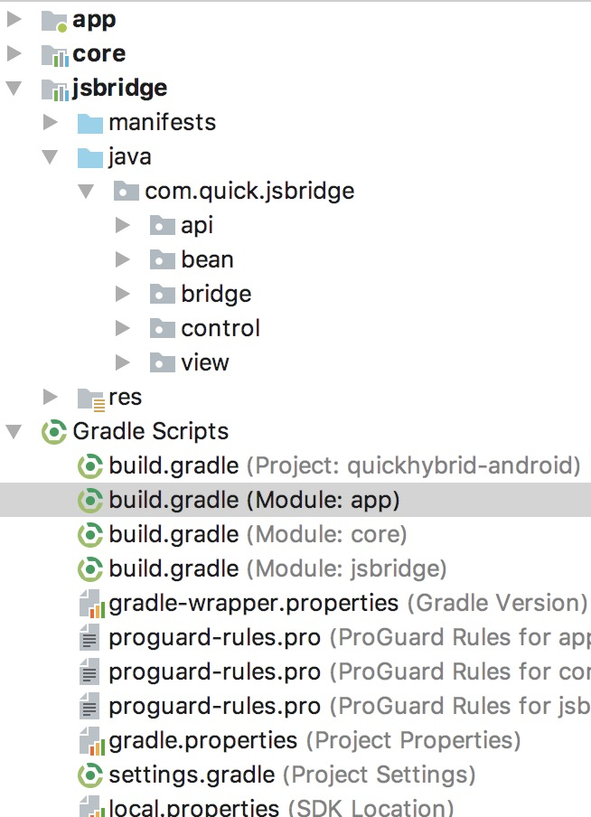

# 【quickhybrid】Android端的项目实现

## 前言

前文中就有提到，Hybrid模式的核心就是在原生，而本文就以此项目的Android部分为例介绍Android部分的实现。

提示，由于各种各样的原因，本项目中的Android容器确保核心交互以及部分重要API实现，关于底层容器优化等机制后续再考虑完善。

大致内容如下：

- JSBridge核心交互部分

- `ui`、`page`、`navigator`等部分常用API的实现

- 组件（自定义）API拓展的实现

- 容器h5支撑的部分完善（如支持fileinput文件选择，地理定位等-默认不生效的）

- API的权限校验仅预留了一个入口，模拟最简单的实现

- 其它如离线资源加载更新，底层优化等机制暂时不提供

## 项目的结构

基于AndroidStudio的项目，为了便于管理，稍微分成了几个模块，
而且由于主要精力已经偏移到了JS前端，已经不想再花大力气重构Android代码了，
因此仅仅是将代码从业务中抽取出来，留下了一些稍微精简的代码（也不是特别精简）。

所以如果发现代码风格，规范等不太合适，请先将就着。

整体目录结构如下：

```js
quickhybrid-android
    |- app                  // application，应用主程序
    |   |- api/PayApi       // 拓展了一个组件API
    |   |- MainActivity     // 入口页面
    |- core                 // library，核心工具类模块，放一些通用工具类
    |   |- baseapp
    |   |- net
    |   |- ui
    |   |- util
    |- jsbridge             // library，JSBridge模块，混合开发的核心实现
    |   |- api
    |   |- bean
    |   |- bridge
    |   |- control
    |   |- view
```



## 代码架构

简单的三次架构：`底层核心工具类->JSBridge桥接实现->app应用实现`

```js
core
    |- application                  // 应用流程控制，Activity管理，崩溃日志等
    |- baseapp                      // 一些基础Activity，Fragment的定义
    |- net                          // 网络请求相关
    |- ui                           // 一些UI效果的定义与实现
    |- util                         // 通用工具类
    
jsbridge
    |- api                          // 定义API，开放原生功能给H5
    |- bean                         // 放一些实体类
    |- bridge                       // 桥接的定义以及核心实现
    |- control                      // 控制类，包括回调控制，页面加载控制，文件选择控制等
    |- view                         // 定义混合开发需要的webview和fragment实现
    
app
    |- api                          // 拓展项目需要的自定义组件API
    |- AppApplication.java          // 应用的控制
    |- MainActivity.java            // 入口界面的控制
```

## 权限配置

原生应用中，不可逃避的就是打包后的权限问题，没有权限，很多功能都使用不了，
简单起见，这里将应用中用的权限都列了出来（基于多种考虑，并没有遵循最小原则）

```html
<!-- ===============================权限配置声明=============================== -->
    <uses-permission android:name="android.permission.READ_PHONE_STATE" />
    <uses-permission android:name="android.permission.CAMERA" />
    <uses-permission android:name="android.permission.ACCESS_COARSE_LOCATION" />
    <uses-permission android:name="android.permission.CALL_PHONE" />
    <uses-permission android:name="android.permission.READ_CALL_LOG" />
    <uses-permission android:name="android.permission.SEND_SMS" />
    <uses-permission android:name="android.permission.VIBRATE" />
    <uses-permission android:name="android.permission.READ_LOGS" />
    <uses-permission android:name="android.permission.MOUNT_UNMOUNT_FILESYSTEMS" />
    <uses-permission android:name="android.permission.WAKE_LOCK" />
    <uses-permission android:name="android.permission.ACCESS_WIFI_STATE" />
    <uses-permission android:name="android.permission.ACCESS_FINE_LOCATION" />
    <uses-permission android:name="android.permission.ACCESS_NETWORK_STATE" />
    <uses-permission android:name="android.permission.CHANGE_WIFI_STATE" />
    <uses-permission android:name="android.permission.SYSTEM_ALERT_WINDOW" />
    <uses-permission android:name="android.permission.INTERNET" />
    <uses-permission android:name="android.permission.WRITE_SETTINGS" />
    <uses-permission android:name="android.permission.WRITE_EXTERNAL_STORAGE" />
    <uses-permission android:name="android.permission.RECORD_AUDIO" />
    <uses-permission android:name="android.permission.READ_OWNER_DATA" />
    <uses-permission android:name="android.permission.READ_CONTACTS" />
    <uses-permission android:name="android.permission.WRITE_CONTACTS" />
    <uses-permission android:name="android.permission.RECEIVE_BOOT_COMPLETED" />
    <uses-permission android:name="android.permission.DISABLE_KEYGUARD" />
    <uses-permission android:name="android.permission.CHANGE_NETWORK_STATE" />
    <uses-permission android:name="com.android.launcher.permission.READ_SETTINGS" />
    <uses-permission android:name="android.permission.GET_ACCOUNTS" />
    <uses-permission android:name="android.permission.READ_PROFILE" />
```

注意，`6.0`之上需要动态权限，请确保已经给应用开了对应的权限

## Gradle配置

AndroidStudio中项目要正确运行起来，需要有一个正确的Gradle配置。

这里也就几个关键性的配置作说明，其余的可以参考源码

__gradle-wrapper.properties__

```js
distributionUrl=https\://services.gradle.org/distributions/gradle-4.2.1-all.zip
```

如果遇到gradle编译不动，可以像上述一样，把这个文件的gradle版本修改为本地用的版本
（否则的话，没有科学上网就很有可能卡住）

__setting.gradle__

```js
include ':app', ':jsbridge', ':core'
```

里面很简单，就是一行代码，将三个用到的模块都引用进来

__build.gradle（core）__

仅挑选了部分进行说明

```js
apply plugin: 'com.android.library'

android {
    compileSdkVersion 25

    defaultConfig {
        minSdkVersion 16
        targetSdkVersion 22
        versionCode 1
        versionName "1.0"
        ...
    }
    ...
}

dependencies {
    compile fileTree(dir: 'libs', include: ['*.jar'])

    compile 'com.android.support:appcompat-v7:25.3.1'
    compile 'com.android.support:support-v4:25.3.1'
    compile 'com.android.support:design:25.3.1'
    compile 'com.android.support:recyclerview-v7:25.3.1'
    compile 'com.android.support.constraint:constraint-layout:1.0.2'
    compile 'com.jakewharton:butterknife:8.6.0'
    compile 'com.google.code.gson:gson:2.8.0'
    compile 'com.journeyapps:zxing-android-embedded:3.5.0'
    compile 'com.liulishuo.filedownloader:library:1.5.5'
    compile 'com.nostra13.universalimageloader:universal-image-loader:1.9.5'
    compile 'me.iwf.photopicker:PhotoPicker:0.9.10@aar'
    compile 'com.github.bumptech.glide:glide:4.1.1'
    ...
}
```

上述的关键信息有几点：

- `apply plugin: 'com.android.library'`代表是模块而不是主应用

- `minSdkVersion 16`代表最低兼容`4.1`的版本

- `targetSdkVersion 25`是编译版本，`targetSdkVersion 22`提供向前兼容的作用，22时不需要动态权限，
主要作用是某些API在不同版本中使用不一样，或者根本就在低版本中没有。

- `versionName`和`versionCode`进行版本控制

- `dependencies`中是依赖信息，首先`compile fileTree`添加了`libs`下的所有离线依赖（里面有离线依赖包），
然后`compile`一些必须的依赖（譬如用到了gson，自动注解，文件下载等等）

为什么这里没用implementation添加依赖，而是用compile？因为implementation不具有传递性，这样引用core的jsbridge就用不到了，
而我们需要确保jsbridge中也用到，所以就用了compile。

__build.gradle（jsbridge）__

一部分类似的代码就没有贴出来了

```js
apply plugin: 'com.android.library'

...

dependencies {
    implementation project(':core')
    ...
}
```

这里和`core`不同之处在于，内部依赖于core模块，使用了`implementation project`，
这样在`jsbridge`内部就能使用core的源码了。

需要注意的是，implementation不具有传递性（core只会暴露给jsbridge，不会传递下去）

__build.gradle（app）__

一部分类似的代码就没有贴出来了

```js
apply plugin: 'com.android.application'

android {
    defaultConfig {
        applicationId "com.quick.quickhybrid"
        versionCode 1
        versionName "1.0"
    }
   ...
}

dependencies {
    implementation project(':core')
    implementation project(':jsbridge')
    implementation fileTree(dir: 'libs', include: ['*.jar'])
    // butterknife8.0+版本支持控件注解必须在可运行的model加上
    annotationProcessor 'com.jakewharton:butterknife-compiler:8.6.0'
    ...
}
```

与之前相比，有几点关键信息

- `apply plugin: 'com.android.application'`代表是主应用而不是模块

- `applicationId`定义了应用id

- 同样有自己的版本控制，但是注意，这里是容器版本号，前面的如jsbridge中是quick的版本号，有区别的

- `implementation`依赖了前面两个模块，同时，后面引入了应用中可能需要的依赖

- `annotationProcessor 'com.jakewharton:butterknife-compiler:8.6.0'`，这行代码是为了使得butterknife自动注解生效的配置

__targetSdkVersion说明__

配置中使用的版本是`22`，因为在这个版本以上会有动态权限问题，比较麻烦，需要更改部分逻辑。因此就暂时未修改了。

譬如操作私有文件的权限问题等等

## 一些关键代码

代码方面，也无法一一全部说明，这里仅列举一些比较重要的步骤实现，其余可参考源码

### UA约定

前面的JS项目中就已经有提到UA约定，就是在加载对于webview时，统一在webview中加上如下UA标识

```js
WebSettings settings = getSettings();
String ua = settings.getUserAgentString();
// 设置浏览器UA,JS端通过UA判断是否属于Quick环境
settings.setUserAgentString(ua + " QuickHybridJs/" + BuildConfig.VERSION_NAME);
```

### 一些关键的webview设置

```js
// 设置支持JS
settings.setJavaScriptEnabled(true);
// 设置是否支持meta标签来控制缩放
settings.setUseWideViewPort(true);
// 缩放至屏幕的大小
settings.setLoadWithOverviewMode(true);
// 设置内置的缩放控件（若SupportZoom为false，该设置项无效）
settings.setBuiltInZoomControls(true);
// 设置缓存模式
// LOAD_DEFAULT 根据HTTP协议header中设置的cache-control属性来执行加载策略
// LOAD_CACHE_ELSE_NETWORK 只要本地有无论是否过期都从本地获取
settings.setCacheMode(WebSettings.LOAD_DEFAULT);
settings.setDomStorageEnabled(true);
// 设置AppCache 需要H5页面配置manifest文件(官方已不推介使用)
String appCachePath = getContext().getCacheDir().getAbsolutePath();
settings.setAppCachePath(appCachePath);
settings.setAppCacheEnabled(true);
if (Build.VERSION.SDK_INT >= Build.VERSION_CODES.KITKAT) {
    // 强制开启android webview debug模式使用Chrome inspect(https://developers.google.com/web/tools/chrome-devtools/remote-debugging/)
    WebView.setWebContentsDebuggingEnabled(true);
}
if (Build.VERSION.SDK_INT >= Build.VERSION_CODES.LOLLIPOP) {
    CookieManager.getInstance().setAcceptThirdPartyCookies(this, true);
}
```

上述的一系列配置下去才能让H5页面的大部分功能正常开启，如localstorage，cookie，viewport，javascript等

### 支持H5地理定位

在继承WebChromeClient的`QuickWebChromeClient`中

```js
    @Override
    public void onGeolocationPermissionsShowPrompt(String origin, GeolocationPermissions.Callback callback) {
        callback.invoke(origin, true, false);
        super.onGeolocationPermissionsShowPrompt(origin, callback);
    }
```

需要重新才支持地理定位，否则纯h5定位无法获取地理位置（或者被迫使用了网络定位）

### 支持文件选择

同样在继承WebChromeClient的`QuickWebChromeClient`中

```js
    /**
     * Android 4.1+适用
     *
     * @param uploadMsg
     * @param acceptType
     * @param capture
     */
    public void openFileChooser(ValueCallback<Uri> uploadMsg, String acceptType, String capture) {
        loadPage.getFileChooser().showFileChooser(uploadMsg, acceptType, capture);
    }

    /**
     * Android 5.0+适用
     *
     * @param webView
     * @param filePathCallback
     * @param fileChooserParams
     * @return
     */
    @RequiresApi(api = Build.VERSION_CODES.LOLLIPOP)
    @Override
    public boolean onShowFileChooser(WebView webView, ValueCallback<Uri[]> filePathCallback, FileChooserParams fileChooserParams) {
        loadPage.getFileChooser().showFileChooser(webView, filePathCallback, fileChooserParams);
        return true;
    }
```

上述的操作是主动监听文件的选择，然后自动调用原生中的处理方案，譬如弹出一个通用的选择框，进行选择等。
如果不实现，无法正常通过FileInput选择文件，而实际上，FileInput又是一个很常用的功能。

### 监听JSBridge的触发

同样在继承WebChromeClient的`QuickWebChromeClient`中

```js
    @Override
    public boolean onJsPrompt(WebView view, String url, String message, String defaultValue, JsPromptResult result) {
        result.confirm(JSBridge.callJava(loadPage.getFragment(), message,loadPage.hasConfig()));
        return true;
    }
```

为了方便，直接使用onJsPrompt来作为交互通道，前文中也相应提到过

### 其它

在直接提供API前，还有很多需要做的基础工作，譬如浏览历史记录管理，监听附件下载，页面加载报错处理等等，这里不再赘述，可以直接参考源码

最后，关于一些JSBridge实现，API实现，由于本系列的其它文中或多或少都已经提到，这里就不再赘述了，可以直接参考源码

另外，后续如果继续有容器优化等操作，也会单独整理，加入本系列。

## 前端页面示例

为了方便，直接集成到了`app/assets/`中，入口页面默认会加载它，也可以直接看源码

## 返回根目录

- [【quickhybrid】如何实现一个Hybrid框架](../quickhybrid_preface/quickhybrid_preface.md)

## 源码

`github`上这个框架的实现

[quickhybrid/quickhybrid](https://github.com/quickhybrid/quickhybrid)
