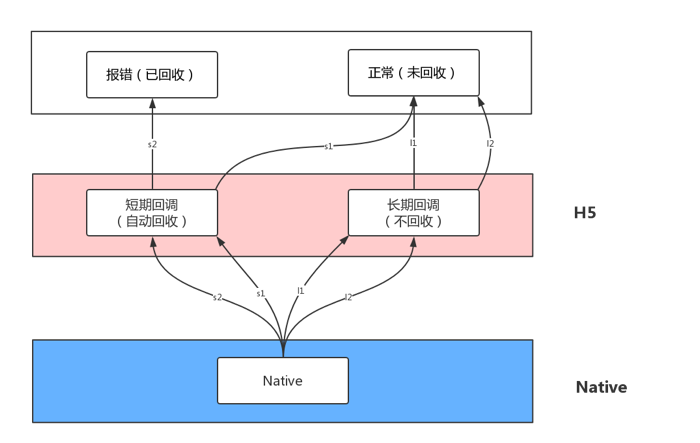

# 【quickhybrid】API的分类：短期API、长期API

## 前言

一切就绪，开始规划API，这里在规划前对API进行了一次分类：__短期API、长期API__

首先申明下，这个是在实际框架演变过程中自创的一个概念，其它混合框架可能也会有这个概念，但应该是会在原生底层来实现，而不是前端实现。。
而这里由于是`前端驱动`，所以相比其它混合框架，前端多了一个处理引擎（包括多平台适配，API处理等等）

## 划分的凭据

__根据API回调的实际执行次数来划分，执行一次自动回收的是短期API，可以执行多次的是长期API__

譬如，短期回调包括：

```js
ui
    alert,toast等等
page
    open,reload等等
...
```

譬如，长期回调包括：

```js
navigator
    hookBackBtn,setRightBtn
event
    registerEvent:'resume','netChange'等等
...
```

而且规定，短期API执行完一次后必须自动删除引用，避免无法及时回收，长期API则不会自动回收，会一直监听直到主动取消或页面关闭

如下图



## 在代码层次两者有何区别？

API设计的一个原则就是尽量简单优雅，所以__在H5的调用层次来看，这两种不会有任何区别__，比如

```js
quick.navigator.setTitle({
    title: '测试标题',
    subTitle: '子标题',
    success: function(result) {},
    error: function(err) {}
});

quick.navigator.setRightBtn({
    isShow: 1,
    text: '按钮右1',
    which: 0,
    success: function(result) {
        /**
         * 按钮点击后回调
         */
    },
    error: function(error) {}
});
```

这两个API从定义上一个是长期回调，一个是短期回调，但是在调用者看来，写法不会有区别，仍然是同一种风格的，也不会要求传递额外参数

### 在框架定义层次，需要区分

虽然在调用层次来看，并无区别，但是在框架内部，还是有所不同的

譬如

```js
// 在原生调用完对应的方法后,会执行对应的回调函数id，并删除
const responseCallbacks = {};
// 长期存在的回调，调用后不会删除
const responseCallbacksLongTerm = {};
```

长期API在调用后，回调会添加到`responseCallbacksLongTerm`池中，短期AP会添加到`responseCallbacks`中

```js
// 这里规定,原生执行方法完毕后准备通知h5执行回调时,回调函数id是responseId
responseCallback = responseCallbacks[responseId];
// 默认先短期再长期
responseCallback = responseCallback || responseCallbacksLongTerm[responseId];
// 执行本地的回调函数
responseCallback && responseCallback(responseData);
delete responseCallbacks[responseId];
```

在回调执行阶段，如果是短期回调，会自动删除引用，方便垃圾处理器自动回收（里面会保证短期id和长期id不重复）

## 在原生容器层面两者的区别？

在H5框架层次，长期API和短期API的差距也不是很大，但是在原生层面，差距明显变大（这也是为什么会把这两种单独划分成两个概念）

为了尽可能的减少冗余信息，我们仅以`navigator.setRightBtn`与`setTitle`API为例，它们的前端调用我们在前面已经看到了，那么它在原生容器中的实现如下

原生中长期API是会先行监听的（考虑过调用后监听和调用前监听两种模式，最终采取了调用前监听-结合了原生原有代码考虑）

以下的伪代码基于前面的`JSBridge`介绍文章，这里假设已经了解了，不再赘述

__注意：这里的setTitle为短期API，但是如果想要给它加上点击回调的话是需要变成长期API的，我们仅以短期的状态为例__

### Android容器中的对比

```js
public class NavigatorApi implements IBridgeImpl {
    public static void setTitle(..., JSONObject params, Callback callback) {
        // 获取了参数后直接改变了导航栏的标题
        ...
        // 然后开始回调
        callback.apply(...);
    }
    
    public static void setRightBtn(..., JSONObject params, Callback callback) {
        // 解析参数，然后将回调信息和监听函数添加到webview控制器中，这个控制器默认监听了很多事件。但只有这些回调信息添加后才会执行
        // 里面也包括了更改按钮的文字或图标
        ...
        WebloaderControl.addPort(callback.port, 'xxx右侧按钮监听事件');
    }
}
```

`WebloaderControl`中的作用是监听各种事件（如利用一些天然的`resume`事件等），然后当对应事件触发时，只有回调池中（`addPort`添加进的）存在，才会执行

```js
其中'xxx右侧按钮监听事件'是在webview自行监听的，这里就不再赘述了

只需直到，WebloaderControl.addPort，右侧监听事件中才会执行添加进去的回调，否则是没有什么操作的
```

可以看到短期API和长期API的形态是不一样的，一个是调用后立即执行，一个是已经监听了，就等着你的回调

### iOS容器中的对比

```js
@implementation NavigatorApi
- (void)registerHandlers {
    [self registerHandlerName:@"setTitle" handler:^(id data, WVJBResponseCallback responseCallback) {
        // 同样，在执行完功能后进行回调
        ...
        responseCallback(...);
    }
    
    [self registerHandlerName:@"setRightBtn" handler:^(id data, WVJBResponseCallback responseCallback) {
        // 里面也包括了更改按钮的文字或图标等一些步骤
        ...
        // 同样，这里是将回调添加到缓存池中，然后监听到对于按钮点击时就会执行回调
        [self cacheCallback:responseCallback handlerName:@"setRightBtn"];
    }
}
```

iOS和Android中相比，虽然实现代码不一样，但是逻辑是一致的，同样在监听后才会执行对应回调

## 结束语

短期和长期概念只是用来更好的划分和管理API，有了这个概念后，接下来就可以开始对API进行统一规划了

## 返回根目录

- [【quickhybrid】如何实现一个Hybrid框架](../quickhybrid_preface/quickhybrid_preface.md)

## 源码

`github`上这个框架的实现

[quickhybrid/quickhybrid](https://github.com/quickhybrid/quickhybrid)
