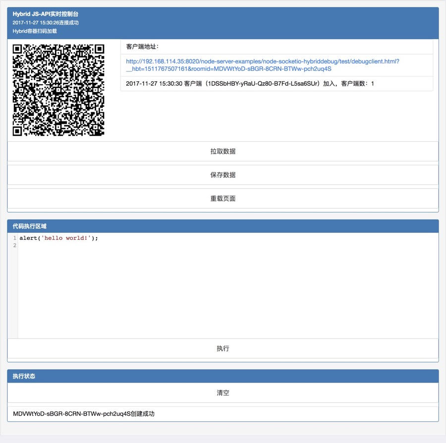

# 【quickhybrid】API规划

## 前言

当一切就绪后，就要开始进行API规划，这一块是整个Hybrid框架中非常重要的内容，毕竟对于前端页面来说，只会通过JS API来调用功能。
基本上，API调用起来是否方便简洁影响着整个体验。

这里将内容细分为以下几点：

- API约束（包括调用格式，传参格式，回调格式）

- 功能规划（约定这个框架应该提供什么样的功能）

- 权限校验（很重要的一块，校验后才能调用，包括权限校验的代码格式，校验一些什么内容，以及哪些API无需校验）

- 模块化的API（按照模块划分，每一个模块可以作为单独的组件，便于拓展）

- 其它优化（如在PC端调试API的页面，部分API支持Promise等）

## API约束

API调用关乎着整个体验，我们约定所有API统一采用如下调用方式

```js
quick.模块名.方法({
    参数1: "",
    参数2: "",
    success: fucntion(result) {
        // 成功回调
    },
    error: fucntion(error) {
        // 失败回调
    }
});
```

__约束说明__

- 所有接口都为异步调用

- 接收一个`object`类型的参数

- 成功回调`success`

    - 通过`result`获取成功数据
    
    - 回调函数的触发时机由具体的API决定，有的API是调用时即可回调（短期），有的是某个事件触发后才被回调（长期）
    
- 失败回调`error`，所有的API调用错误都会走失败回调

### 功能规划

混合开发框架最重要的一个功能就是__将原生功能以JS API形式提供给前端页面调用__

本框架的API规划如下：（这个项目中仅规划了部分功能，实际使用中自行拓展即可）

```js
quick
    |- ui               // 系统ui组件
    |   |- toast        
    |   |- alert       
    |   |- confirm       
    |   |- prompt          
    |   |- showWaiting         
    |   |- closeWaiting          
    |   |- actionSheet       
    |   |- pickDate     
    |   |- pickTime
    |   |- pickDateTime
    |   |- popWindow
    |- page             // 页面（webview）管理
    |   |- open
    |   |- openLocal
    |   |- close
    |   |- reload
    |- navigator        // 导航栏控制
    |   |- setTitle
    |   |- setMultiTitle
    |   |- hookSysBack
    |   |- hookBackBtn
    |   |- setRightBtn
    |   |- setLeftBtn
    |   |- setRightMenu
    |- auth             // 权限认证相关
    |   |- getToken
    |- device           // 设备相关
    |   |- setOrientation
    |   |- getDeviceId
    |   |- getNetWorkInfo
    |   |- getVendorInfo
    |   |- closeInputKeyboard
    |   |- vibrate
    |   |- callPhone
    |   |- sendMsg
    |- runtime          // 运行环境
    |   |- launchApp
    |   |- getAppVersion
    |   |- getQuickVersion
    |   |- getGeolocation
    |   |- clearCache
    |   |- clipboard
    |   |- openUrl
    |- util             // 其它工具
    |   |- scan
    |   |- selectImage
    |   |- cameraImage
    |   |- selectFile
    |   |- openFile
```

上述规划的是最常用到的功能，具体每一个API的介绍，传入参数传出参数等会在框架的API文档中提到

## 权限校验

__如果整套框架要对外开放（如允许第三方按规范接入），那么权限认证是必不可少的！__

如果没有权限认证？可以想象下，随便一个页面就能调用任意API，获取敏感信息。。。

那么权限认证应该是怎样的呢？根据不同需求，可以划分一个等级。

- 平台级别的（像钉钉、微信这类对外开放的），需要配合后台，有完整的授权，签名，校验机制

- 项目级别的（N个项目同一个框架，但业务各不相同），简单的应用内部配置，直接校验一些域名白名单信息即可

当然了，这个框架是后面的项目级别的，大批量的项目都采用的，因此直接简单配置即可（示例中是在原生预留了这个入口，但没有实现）

这里暂不谈具体实现（实现可参考源码），只说说权限认证的流程：（如钉钉、微信中的）

```js
quick.error(function(error) {
    // 处理错误
});

quick.config({
    ...
});
quick.ready(function() {
    // TODO: 处理验证成功后的事情，例如调用api
});
```

可以看到，和其它框架一样，前端也是`config`，`ready`，`error`三步，
然后原生接收到`config`时，内部进行校验（校验内容可以是检测页面地址是否符合域名白名单等等...）

而且，如果`config`失败或者没有校验，那么敏感API都无法调用

__无需校验就可用的API__

并不是所有API都需校验后才能用，我们约定以下API默认就可用（这里是一个粗糙的划分，实际上可以精确到每一个API）

```js
ui模块的所有API
page模块的所有API
navigator模块的所有API
```

这样做的好处是，如果不涉及到一些敏感数据，可以无需校验，提供效率（校验如果规则毕竟重的话对速度还是有影响的）

## 模块化的API

有一个全局变量`quick`，但API并不是直接绑定在全局变量下，而是按模块划分，譬如

```js
quick.ui
quick.device
quick.page
...
```

这里说明一下，用模块化划分，除了前端调用会更清晰外，原生进行API定义与组件API拓展时也更方便。

__组件API的拓展机制__

关于组件API的拓展机制，这里也不具体描述如何实现（实现可参考源码），仅说说大概是一个什么样的东西。

默认情况下，框架会注册以下组件（前面已经规划的所有模块）

```js
ui
page
navigator
auth
device
runtime
util
```

但是假设某项目中突然遇到了一个需求，要新增一个支付功能，并且要以API的形式提供给H5页面调用，该如何实现呢？

注意，这个框架设计的初衷是可以供N个项目使用，所以不可能所有的功能都集成进入框架中的，各个项目可以拓展自己的组件

这时候就需要规划这个拓展机制了，如下

```js
// 1.前端config时，传入需要注册的组件别名
quick.config({
   jsApiList: ['pay', 'speech']
});
```

```js
// 2.原生框架中，接收到config后，基于传入的别名，去对应项目配置文件中查询路径，然后将对应路径的API实现类注册
// 对应的组件的API实现类不是放框架中的，而是由各自的项目管理的，到时候框架就是一个固定的库，给各个项目引用
// 代码实现这里省略
...
```

```js
// 3.前端中，通过一个固定的方法，调用刚注册的组件API中的功能
quick.callApi({
    name: 'xxx',
    mudule: 'pay',
    ...
    data: {},
    success: function(result) {},
    error: function(error) {},
});
```

通过这一套机制，可以保持框架的可拓展性，就算应用不同的项目中，N多的功能，也能通过这种方法拓展，保持一致的使用

## 其它优化

在大体功能都实现后，接下来还需要做一些优化功能，具体效果可以是简化调用，也可以是方便调试

__部分API支持`Promise`__

前面定义的API中都是基于普通的回调进行的，在多层回调嵌套时仍然会毕竟麻烦，因此可以拓展支持Promise调用方式

在拓展前，先定一个基调：__所有短期回调都支持Promise调用，长期回调不建议使用Promise__

因为长期回调涉及到多次回调（比如右上角按钮），所以不建议使用Promise，如果强行要使用，这些API调用完毕后马上就会进入then

具体实现参考源码，这里稍微对比下普通调用与Promise调用

```js
quick.ui.alert({
    title: '提示',
    message: 'sd#ddd测试',
    success: function(result) {
        console.log('点击alert成功');
    },
    error: function(error) {
        console.error('失败:' + JSON.stringify(error));
    }
});
```

```js
quick.ui.alert({
    title: '提示',
    message: 'sd#ddd测试',
}).then(function(result) {
    console.log('点击alert成功');
}).catch(function(error) {
    console.error('失败:' + JSON.stringify(error));
});
```

上述还只是没有嵌套的对比情况，有嵌套时，区别更大

__PC端调试API__

类似于钉钉的调试页面，这里也规划了一个在PC端调试API的页面（基于websocket），后续会有更详细的说明。

原理方面的源码可以先参考[https://github.com/dailc/node-server-examples/tree/master/node-socketio-hybriddebug](https://github.com/dailc/node-server-examples/tree/master/node-socketio-hybriddebug)

可以先预览下效果



__其它__

其它优化后续再介绍

## 返回根目录

- [【quickhybrid】如何实现一个Hybrid框架](../quickhybrid_preface/quickhybrid_preface.md)

## 源码

`github`上这个框架的实现

[quickhybrid/quickhybrid](https://github.com/quickhybrid/quickhybrid)
