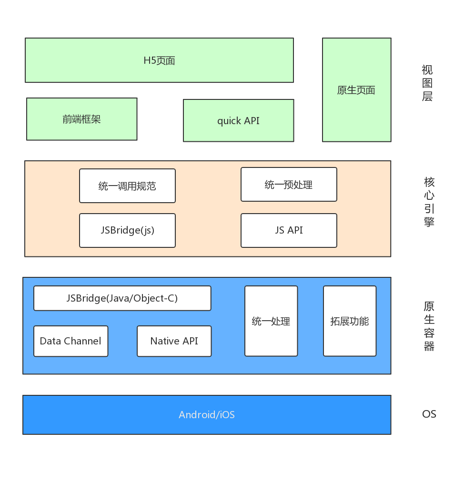

# 【quickhybrid】架构一个Hybrid框架

## 前言

虽然说本系列中架构篇是第一章，但实际过程中是在慢慢演化的第二版中才有这个概念，
经过不断的迭代，演化才逐步稳定

## 明确目标

首先明确需要做成一个什么样的框架？

大致就是：

- 一套API规范（统一`Android`与`iOS`），所有API异步调用（防止阻塞）

- 提供大部分原生功能的API（包括很多常用的功能给`H5`使用）

- 原生需要能调用到`H5`中注册的方法（用关于原生主动通知）

- 部分API需要支持`H5`环境（譬如`alert`需要在`Android`、`iOS`、浏览器中同时运行）

- API类别需要包括事件监听（如网络变化），页面跳转（如打开页面，关闭通过回调回传值），UI显示（调用后立即执行）等

## 整体架构

其中：

- `quick API`指的就是`quick hybrid`框架提供给`H5`调用的`JS API`

- 最外层的统一`JSAPI`规范就是`quick API`

- 多平台支持的意思是-譬如调用了`quick.ui.alert`，在`quick hybrid`容器中会有响应（原生的弹窗），
同时在浏览器中也会有响应（`H5`实现的弹窗），或者在其它容器中（如`DD`）也会有响应（其它容器实现的弹窗）

- 多平台支持并不是所有API都会支持，而是指一些常用的API在多个平台下都有实现（比如`UI`类API一般都会支持，但是原生设备相关就不会在浏览器支持）

## 【目标分析】需要哪些工作

根据`quick hybrid`的整体架构与目标，我们需要先分析需要实现哪一些内容：

- 【核心工作】制定`quick`平台下前端和原生容器的交互规则（`JSBridge`）

- 【核心工作】前端和原生（`Android/iOS`）分别实现`JSBridge`交互（包括互相调用，回调等机制）

- 【核心工作】完成前端调用多平台的支撑（API在不同平台下有不同实现，并会根据不同环境自动转换）

- 【重要工作】规划功能API（需要提供哪些功能，并且每一个功能应该在哪些平台下有实现）

- 【重要工作】前端和原生（`Android/iOS`）分别实现这些功能API（第一步根据二八原则实现重点API即可）

- 【重要工作】处理好短期API（即调即用，立即回收），长期API（一个页面中能被多次触发，如导航了按钮监听），事件监听API（整个应用生命周期内监听，如网络变化）等不同类型

- 【优化完善】原生API实现的优化，前端代码的优化，权限认证，本地资源等等

然后就可以基于这些目标，逐步完成每一个规划的内容

## 【分解目标】总体规划

- [【quick hybrid】JSBridge的实现](../quickhybrid_jsbridge/quickhybrid_jsbridge.md)

- [【quick hybrid】H5和原生的职责划分](../quickhybrid_h5ornative/quickhybrid_h5ornative.md)

- [【quick hybrid】API的分类：短期API、长期API](../quickhybrid_apiclassify/quickhybrid_apiclassify.md)

- [【quick hybrid】API规划](../quickhybrid_apiplanning/quickhybrid_apiplanning.md)

拓展：

- [【quick hybrid】H5和Native交互原理](../quickhybrid_native2h5interaction/quickhybrid_native2h5interaction.md)

## 【分解目标】API的实现

- [【quick hybrid】API多平台支撑的实现](../quickhybrid_apimultiplatform/quickhybrid_apimultiplatform.md)

- [【quick hybrid】组件（自定义）API的实现](../quickhybrid_apicomponents/quickhybrid_apicomponents.md)

- [【quick hybrid】JS端的项目实现](../quickhybrid_apijs/quickhybrid_apijs.md)

- [【quick hybrid】Android端的项目实现](../quickhybrid_apiandroid/quickhybrid_apiandroid.md)

- [【quick hybrid】iOS端的项目实现](../quickhybrid_apiios/quickhybrid_apiios.md)

## 【分解目标】优化与完善

- 【quick hybrid】优化与完善

    - 基于Socket打造Hybrid调试页面

    - 账号体系、Cookie还是Token？

    - hybrid容器的优化

## 返回根目录

- [【quickhybrid】如何实现一个Hybrid框架](../quickhybrid_preface/quickhybrid_preface.md)

## 源码

`github`上这个框架的实现

[quickhybrid/quickhybrid](https://github.com/quickhybrid/quickhybrid)
