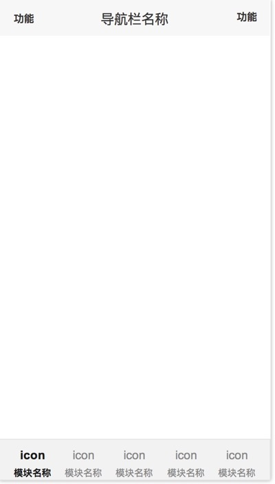
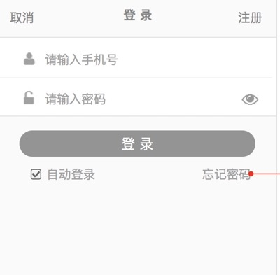
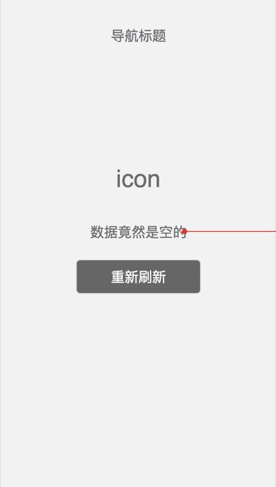
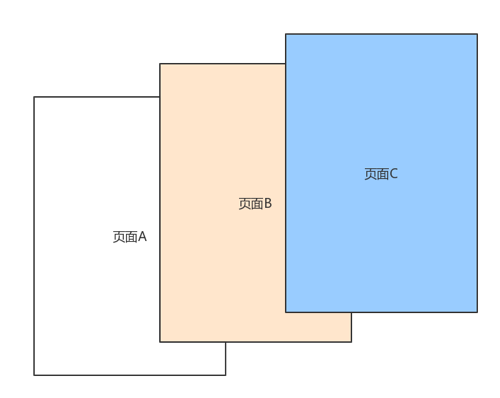

# 【quickhybrid】H5和原生的职责划分

## 前言

在JSBridge实现后，前端网页与原生的交互已经通了，接下来就要开始规划API，明确需要提供哪一些功能来供前端调用。

但是在这之前，还有一点重要工作需要做：

__明确H5与Native的职责划分，确定哪一些功能可以由H5实现，哪一些功能只能由原生实现__

## Native与H5职责划分

使用Hybrid模式，用H5开发页面的本质是：

__减少工作量（一套代码，多个平台），以及快速的更新迭代（譬如线上更新），而且还需要考虑Native端的高性能以及系统API调用能力（否则直接用纯H5就可以了）__

因此在进行职责划分时，就得充分的考虑前端渲染，JS语言以及原生渲染，Java/OC等语言的特性，__基本总结如下：__

- 混合页面导航栏组件由原生实现

- 一些重要的业务页面、带有复杂动画或交互的页面以及一些固定页面由原生实现

- 系统级UI由原生统一实现

- 页面切换的转场由原生实现

- CPU密集型任务、底层的优化要由原生完成

- 其它功能能用H5实现（并且效果不错）的就尽量不要用原生

## 导航栏组件由Native实现

尝试过，也对比过很多的混合开发框架，譬如Dcloud的HTML5+，钉钉里的DD API，自己也尝试过不同的方式，
最终发现导航栏的最好做法还是由原生提供，核心原因如下：

- __H5页面加载过程会有白屏问题（也别是弱网络情况）__，如果整个页面都是H5实现，那么白屏了就体验非常差，而且连基本的交互与操作都没了

仅基于这一点，就已经拍板了由Native导航栏组件+webview（加载H5）来组成页面，而原生提供一些API来供网页操控导航栏（譬如标题，按钮等）

整体页面布局如下：


而H5端可以通过原生提供的API来操控导航栏，以下举例为quick中规划的API:

```js
// 仅提供一部分示例
quick.navigator.setTitle({
    title: '标题',
    subTitle: '子标题',
    success: function(result) {},
    error: function(error) {}
});

quick.navigator.setRightBtn({
    isShow: 1,
    text: '按钮右1',
    // 设置图片的优先级会较高
    //imageUrl: 'http://xxx/test.png',
    // 从右数起第几个
    which: 0,
    success: function(result) {
        /**
         * 按钮点击后回调
         */
    },
    error: function(error) {}
});
```

### 多tab页面也由原生提供

实际开发中Native导航栏组件+webview也就满足绝大部分的页面需求了，但是还有一些特殊页面是这种实现达不到的，譬如多Tab页面



上述这种内含多tab的页面，每一个tab里都是单独的页面，而且可以通过滑动等手势来切换，甚至tab还会有一些渐变动画，导航栏也配合改变等（常见于APP首页）

为了统一实现，这类页面的导航栏与底部tab均是由原生实现，由H5通过API打开这类原生页面，并将需要加载的网页地址传入，如下

```js
quick.page.openLocal({
    className: '那种原生页面的标识，可以唯一查询到相应的界面',
    data: {
        // 需要加载的n个url
        url1: 'http://...',
        urln: 'http://...',
    },
    success: function(result) {},
    error: function(error) {}
});
```

然后，在每一个前端页面（webview里加载的内容），可以分别在对于页面的脚本里进行自己的交互控制

## 重要的业务页面由原生实现

对于一些重要的业务页面，如登陆，注册，支付等，处于安全性以及交互性的考虑（就是一个APP的门面），会采用完全由Native实现
（当然了，一般这些页面的变动频率也不大）



### 一些默认提示页面采用原生实现

webview加载网页时，一般情况原生都是会对加载情况进行监听的，比如是否网络异常。服务器响应异常，页面加载崩溃等，
为了防止APP假死，原生会提高一些默认提示页面



上述只是一个原型示例，实际上，很多情况都可以由原生提供统一提示页面，
如404，页面崩溃，网络错误等

### 交互性强、动画复杂的页面采用原生实现

除了关键性页面，还有一类，就是H5不好实现的（或者说达不到要求的、实现代价过大的），也应该由原生实现

譬如以某图像处理软件某个界面截图为例


这种页面涉及到了明显不太适合H5实现的图像处理，因此原生才是更佳的选择（当然了，实际上H5的canvas是由图像处理能力的）

## 系统级UI由原生统一实现

前面提到了页面的选择，但页面内的内容也是需要抉择的，比如一些UI显示控件（alert，toast等）

虽然H5完成可以实现这些UI控件，并且可以和原生模拟的一样，但是基于以下考虑，所有系统级的UI全部由原生实现并提供API:（原生和H5需统一风格）

- 每一个合格的原生应用本身就会有一套自己风格的UI，因此不存在重复开发问题

- H5本身可以实现这些组件，但是如果要模拟的和原生一摸一样的话代价并不小，而且体验并不能完全接近原生（比如遮罩无法覆盖导航栏）

- 如果是原生提供的，更改风格时原生改掉就行了，其它无效变动，如果H5单独维护一套，那么就被迫一起同步，平白新增很多的工作量

- 而且H5还会存在一些坐标、尺寸计算偏差问题

一般情况下H5通过如下API即可调用

```js
quick.ui.toast('xxxx');
quick.ui.alert('xxxx');

quick.ui.alert({
    title: "标题",
    message: "信息",
    buttonName: "确定",
    success: function(result) {
        // 点击 alert的按钮后回调
    },
    error: function(err) {}
});
```


## 页面切换的转场由原生实现

一般PC浏览器中，页面之间的调整直接通过`a标签`完成（或者改变`href`跳转），
但是这种跳转有一个缺点：

__无法使用转场动画，每次都是干巴巴的等浏览器加载进度条，体验很差__

因此针对这种情况，原生需要提供特点的API来供页面调用，可以有原生转场动画，在新的webview中打开这个页面

```js
quick.page.open({
    pageUrl: "./xxx.html",
    data: {
        // 额外传递的数据
        key1: 'value1'
    },
    success: function(result) {},
    error: function(error) {}
});
```

采用这种方式打开的页面不再是在本webview中跳转，而是直接用新的webview打开，有过渡动画，而且以前的页面仍然存在内存中，接近原生体验

譬如

```js
页面A -> 页面B -> 页面C
```



可以看到，如果是直接调整，页面A和B是不存存在的，而是会被替换，但是采用原生webview打开后，三个页面同时存在

### 仍然支持第三方页面的href跳转

虽然说可以有API打开的增强方式，但是仍然需要支持href跳转，这在集成第三方页面时十分重要（将已经写好的第三方纯网页集成到容器中，作为某个子模块）

这里有一点需要注意：

```js
这类页面一般由a标签或href跳转直接打开，没有转场动画，但是需要webview容器保存访问历史记录，
以避免多次跳转后一个后退就直接退出了整个模块
```

## CPU密集型任务、底层的优化要由原生完成

当涉及到一些大量计算时，尽量避免直接在网页端完成，而是应该由原生提供API完成。

譬如对一张图片进行图像处理（曝光、水印、压缩等等），如果直接由网页完成的话会发现非常卡，发热也严重，而原生则没有这么多的问题

关于底层优化，__其实整套混合开发框架中，底层容器的实现是核心部分__

容器是否健壮，优化的如何，直接影响整个应用的体验

关于原生容器应该如何进行优化，后续会有专门的文章，这里不赘述，只是稍微提及一下：

- 支持H5页面的离线访问（有线上版本和离线版本，通过本地路由表映射）

- 离线资源动态更新（结合离线访问一起，比较复杂）

- 资源缓存（如图片的缓存，脚本样式的缓存等）

- 统一数据埋点采样等（手机应用使用数据）

- ajax请求等等（还有很多，不一一列举）

## 能用H5实现的就尽量不要用原生

接下来就是在实际开发过程遵循的准则：

- 能用H5实现的就尽量不要用原生

乍看之下可能和上述的有矛盾，但其实又是合理的，在排除了一些不适合H5实现的页面，剩余的绝大部分都是普通的业务页面，
这类页面基本可以毫无压力的采用H5。

所以，这时候，第一想法都是采用H5完成（因为一套代码可以在至少三个平台运行-浏览器，Android，iOS），
遇到一些比较困难的页面再去考虑原生实现（从开发效率上，维护代价上，更新方便上都比较麻烦）

__那些H5开发中遇到最多的页面__

最后，看下实际开发过程中遇到的最多的页面吧（以实际遇到的`N`个项目的总结）

- 列表页面（下拉刷新，加载更多）

- 纯详情展示页面（标题，关键字，内容）

- 九宫格首页

- 图片轮播（时常结合列表和九宫格）

- 标准的表单提交页面

没错，`80%`都是上述这种可以算非常简单的页面。

譬如封装过一个下拉刷新组件，基本别人基于这个组件来开发，列表的代码几乎是千篇一律。（当然了，剥离了业务逻辑而言）

## 结束语

时至今日，`Hybrid`模式已经过了它最火的时候，市面上也出现如`weex`，`react-native`等直接写原生组件的框架，
但是，现在使用最多，应用最广的仍然要属这种传统的Hybrid模式，它已经进入了稳定期（可以说，传统H5开发（泛概念）不被APP淘汰，这种模式很难被挤下舞台）

## 返回根目录

- [【quickhybrid】如何实现一个Hybrid框架](../quickhybrid_preface/quickhybrid_preface.md)

## 源码

`github`上这个框架的实现

[quickhybrid/quickhybrid](https://github.com/quickhybrid/quickhybrid)

## 附录

### 参考资料

- [Hybrid APP架构设计思路](https://segmentfault.com/a/1190000004263182)