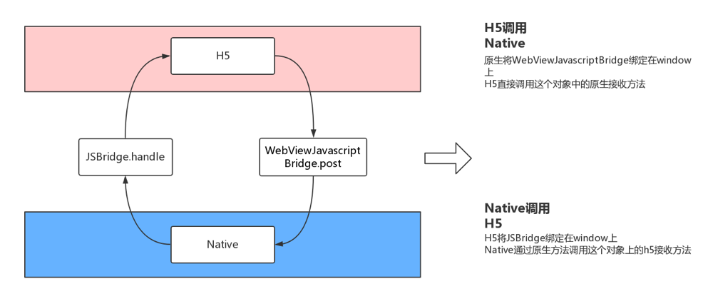
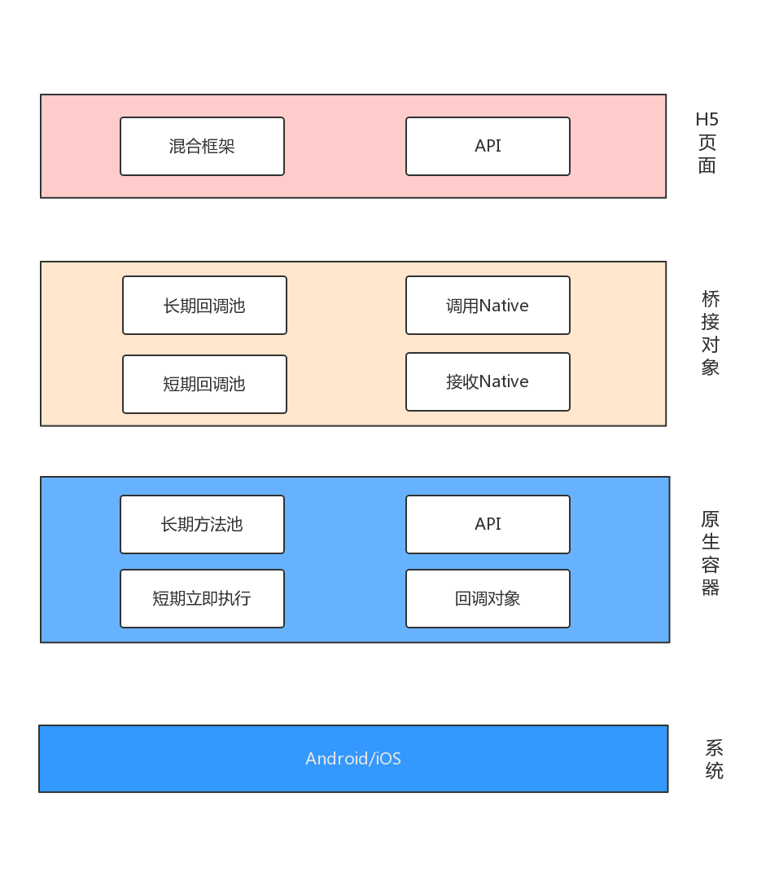
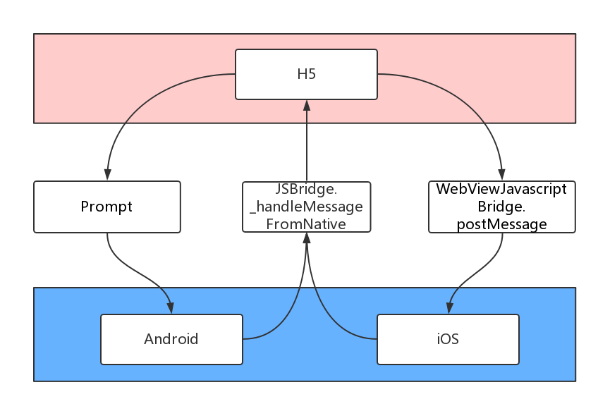

# 【quickhybrid】JSBridge的实现

## 前言

本文介绍`quick hybrid`框架的核心`JSBridge`的实现

由于在最新版本中，已经没有考虑`iOS7`等低版本，因此在选用方案时没有采用`url scheme`方式，而是直接基于`WKWebView`实现

## 交互原理

具体H5和Native的交互原理可以参考前文的`H5和Native交互原理`

交互原理图如下：



## 预计的最终效果

如果一步一步来分析，最后再看效果，可能会很枯燥，甚至还有点化简为繁的样子。（感觉直接看代码应该是最简单的，奈何每次写成文章时都得加一大堆的描述）

因此，先来看看最终完成后应该是什么样的。

```js
// 调用ui中alert的示例
callHandler({
    // 模块名，本文中的API划分了模块
    module: 'ui',
    // 方法名
    name: 'alert',
    // 需要传递给native的请求参数
    data: {
        message: 'hello',
    },
    callback: function(res) {
        /**
         * 调用后的回调，接收原生传递的回调数据
         * alert如果成功，可以点击后再回调
         {
            // 1成功/0失败
            code: 1,
            message: '描述',
            // 数据
            data: {},
         }
         */
    }
});
```

## 架构

从头开始实现一个JSBridge，很容易两眼一抹黑，无从下手。

因此我们需要先从大方向上把功能交互确定好，然后再开始构建细节，编码实现



## 功能分析与确认

根据核心架构，规划需要实现的功能：

- H5桥接对象的设计（JSBridge）

    - 短期回调池，需自动回收
    
    - 长期回调池，可多次使用
    
    - 调用Native方法的通道，桥接对象上原生注册的接收方法
    
    - 接收Native调用的通道，桥接对象上H5注册的接收方法
    
    - H5可以注册主动给原生调用的方法
    
- 原生桥接对象的设计

    - 长期方法池，每一个长期调用都会存储在回调池中，可以多次使用
    
    - 短期立即执行，每一个短期调用都是立即执行
    
    - 调用H5方法的通道，桥接对象上H5注册的接收方法
    
    - 接收H5调用的通道，桥接对象上原生注册的接收方法，底层自动解析，然后执行对应API
    
    - 回调对象，底层基于调用H5的通道，每次执行完毕后都通过回调对象回调给H5
    
    - 主动调用H5，不同于回调对象只能被动响应，这个可以主动调用H5中注册的方法

- API的设计

    - H5中的API，供前端调用，底层通过调用Native方法的通道，然后将预处理后的参数发送给原生
    
    - Native中的API，真正的功能实现
    
接下来就是JSBridge的实现
    
## 全局通信对象的确认

最重要的，是先把H5和Native通信时的几个全局桥接对象确定：

- `JSBridge`，H5端的桥接对象，对象中绑定了接收原生调用的方法`_handleMessageFromNative`，以及内部有对回调函数等进行管理

- `webkit.messageHandlers.WKWebViewJavascriptBridge.postMessage`，iOS端的桥接对象，这个方法接收H5的调用

- `prompt`，Android端的桥接对象，为了方便，直接重写了`WebChromeClient`中的`onJsPrompt`

```js
// H5端的内部逻辑处理
window.JSBridge = {...}

// 接收原生的调用，有回调以及主动调用两种
JSBridge._handleMessageFromNative = function() {...}
```

```js
// H5主动调用原生
if (os.ios) {
    // ios采用
    window.webkit.messageHandlers.WKWebViewJavascriptBridge.postMessage(...);
} else {
    window.top.prompt(...);
}
```

## JSBridge对象的实现

H5就依靠这个对象与Native通信，这里仅介绍核心的逻辑

```js
JSBridge = {
    // 本地注册的方法集合,原生只能主动调用本地注册的方法
    messageHandlers: {},
    // 短期回调函数集合，在原生调用完对应的方法后会自动删除回收
    responseCallbacks: {},
    // 长期存在的回调集合，可以多次调用
    responseCallbacksLongTerm: {},
    
    _handleMessageFromNative: function(messageJSON) {
        // 内部的处理：
        
        ／**
          如果是回调函数：
          如果是短期回调responseCallbacks中查询回调id，并执行，执行后自动销毁
          如果是短期回调responseCallbacksLongTerm中查询回调id，并执行
          *／
          
          ／**
          如果是Native的主动调用：
          去本地注册的方法池messageHandlers中搜索，并执行
          *／
    },
    
    callHandler: function(...) {
        // 底层分别调用Android或iOS的原生接收方法
        
        // 如果是短期回调，会将回调添加到responseCallbacks中
        // 如果是长期回调，会将回调添加到responseCallbacksLongTerm中
        
        // 省略若干逻辑
        ...
        
        if (os.ios) {
            // ios采用
            window.webkit.messageHandlers.WKWebViewJavascriptBridge.postMessage(...);
        } else {
            window.top.prompt(...);
        }
    },
    
    registerHandler: function(handlerName, handler) {
        // H5在本地注册可供原生调用的方法
    },
    
    ...
};
```

## Android中桥接对象的实现

Android中的核心就是`JSBridge`，其余都是围绕这个来的，以下是伪代码，列举主要的逻辑

```js
public class JSBridge {
    // 缓存所有的API模块（注册时添加进去）
    static exposedAPIModlues =  new HashMap<>();
    
    static register(String apiModelName, Class<? extends IBridgeImpl> clazz) {
        // 注册时会自动寻找所有的框架API模块，然后添加到缓存exposedAPIModlues，每一个模块中可以有若干API
        // 每一个模块都需要实现IBridgeImpl接口
        ...
    }
    
    static callAPI(...) {
        // 首先会解析参数（H5中传递的），解析出调用了哪一个API，传递了些什么，解析结果包括如下
        // port:H5传递的回调id，是responseCallbacks或responseCallbacksLongTerm中的key
        // moduleName:调用的API的模块名，用来检索exposedAPIModlues中注册的模块
        // name:调用的API的方法名，在对于找到的模块中去查找API
        // 其他:包括传递的参数等等
        
        // 然后会根据H5的回调端口号，生成一个回调对象（用来回调通知H5）
        Callback callback = new Callback(port);
        
        // 之后，根据解析的参数寻找API方法
        // java.lang.reflect.Method;
        Method method = searchMethodBy(moduleName, name);
        
        // 没有找到方法会回调对于错误信息
        // 否则执行对于的method，传递解析出的参数
        // 并且在method内部执行完毕后主动回调给H5对于信息
        method.invoke(..., callback);
    }
}
```

`callback`类伪代码如下：

```js
public class Callback {
    apply(...) {
        // 先解析拼装参数，然后将参数组装成javascript代码，参数中包含Callback对于的port值（回调id）
        ...
        String js = javascript:JSBridge._handleMessageFromNative(对于的json参数);
        
        callJS(js);
    }
    callHandler(...) {
        // 主动调用H5，封装的参数中不再是回调id，而是handleName
        ...
        callJS(js);
    }
    callJS(js) {
        // 底层通过loadUrl执行
        ...
        webviewContext.loadUrl(js);
    }
}
```

`IBridgeImpl`接口是空的，只是一个抽象定义，以下以某个实现这个接口的API为例

```js
// 为了清晰，以ui.alert为例
public class xxxApi implements IBridgeImpl {
    // 定义一个注册的模块别名，方便查找，譬如ui
    static RegisterName = "ui";
    
    // 模块中的某个API，譬如alert
    public static void alert(..., Callback callback) {
        // 接下来就是在这个API中实现对于的逻辑
        ...
        // 最后，通过触发callback通知H5即可
        callback.apply(...);
    }
}
```

最后可以看到，在`webview`中，重新了`WebChromeClient`的`onJsPrompt`来接收H5的调用

并且在`webview`加载时就会调用`JSBridge`的`register`

```js
public class XXXWebChromeClient extends WebChromeClient {
    @Override
    public boolean onJsPrompt(..., JsPromptResult result) {
        // 内部触发JSBridge.callJava
        result.confirm(JSBridge.callJava(...));
        return true;
    }
}
```

以上几个就是`Andorid`中JSBridge核心实现，其他的如长期回调，短期回调，细节实现等优化不是核心逻辑，就列举，详情可以参考最后的源码

## iOS中桥接对象的实现

这里仍然是`OC`实现的，主要参考的[marcuswestin/WebViewJavascriptBridge](https://github.com/marcuswestin/WebViewJavascriptBridge)实现

核心仍然是`WKWebViewJavascriptBridge`，其余一切都是通过它来分发代理

```js
@implementation WKWebViewJavascriptBridge {
    // 内部基于一个WebViewJavascriptBridgeBase基类（基类中定义交互方法）
    WebViewJavascriptBridgeBase *_base;    
}
/**
 * API
 */
- (void)callHandler:(NSString *)handlerName data:(id)data {
    // 主动调用H5的方法
    // 底层调用_base的sendData，发送数据给H5
}

- (void)registerModuleFrameAPI {
    // 注册模块API，模块用到了别名代理
    [self registerHandlersWithClassName:@"UIApi" moduleName:@"ui"];
    
    // 其中registerHandlersWithClassName就是将模块示例化注册到全局中的作用，不赘述
}

- (void)excuteMessage:(NSString *)message {
    // 内部执行API的实现，这里会解析API解析出来的数据，如
    // module.name,port(callbackid)等
    ...
    // 然后底层调用_base的excuteMsg（它内部会根据注册的API，找到相对应的，然后执行原生功能，最后通过回调通知H5）
}

#pragma mark - WKScriptMessageHandler其实就是一个遵循的协议，它能让网页通过JS把消息发送给OC
- (void)userContentController:(WKUserContentController *)userContentController didReceiveScriptMessage:(WKScriptMessage *)message {
    // 监听到对于API调用时，底层会调用excuteMessage
    if ([message.name isEqualToString:@"WKWebViewJavascriptBridge"]) {
        [self excuteMessage:message.body];
    }
}
```

然后看看它基类`WebViewJavascriptBridgeBase`的实现

```js
@implementation WebViewJavascriptBridgeBase

- (void)sendData:(id)data responseCallback:(WVJBResponseCallback)responseCallback handlerName:(NSString*)handlerName {
    // 底层将接收到的数据组装成js代码执行
    ...
    NSString* javascriptCommand = [NSString stringWithFormat:@"JSBridge._handleMessageFromNative('%@');", messageJSON];
    
    [_webView evaluateJavaScript:javascriptCommand completionHandler:nil];
}

- (void)excuteMsg:(NSString *)messageQueueString moduleName:(NSString *)moduleName {
    // 底层根据对于的模块，API名，找到注册的handler
    ...
    
    // 然后创建一个回调对象
    WVJBResponseCallback responseCallback = (通过sendData通知H5回调数据);
    
    // 然后执行这个handler
    handler(message[@"data"], responseCallback);
}
```

接下来是API的定义

定义API模块之前，需要先了解`RegisterBaseClass`，所有模块必须实现的基类，定义了如何注册

```js
@implementation RegisterBaseClass
#pragma mark - 注册api的统一方法
- (void)registerHandlers {
    // 子类重写改方法实现自定义API注册
}

#pragma mark - handler存取
- (void)registerHandlerName:(NSString *)handleName
                    handler:(WVJBHandler)handler {
    // 注册某个模块下的某个API
}

- (WVJBHandler)handler:(NSString *)handlerName {
    // 通过名称获取对应的API
}
```

要定义一个API模块，则需继承`RegisterBaseClass`然后重写`registerHandlers`（为了清晰，以ui.alert为例）

```js
@implementation UIApi
- (void)registerHandlers {
    [self registerHandlerName:@"alert" handler:^(id data, WVJBResponseCallback responseCallback) {
        // 同样，在接收到数据，并处理后，通过responseCallback通知H5
        ...
        responseCallback(...);
    }
}
```

在`webview`加载时就会调用`WKWebViewJavascriptBridge`的`registerModuleFrameAPI`，对于模块名`ui`与别名`UIApi`，可以在注册时看到，它们之间是有一一对应关系的

然后在webview创建时，会进行监听，`userContentController`

```js
WKWebViewConfiguration * webConfig = [[WKWebViewConfiguration alloc] init];
WKUserContentController * userContentVC = [[WKUserContentController alloc] init];
webConfig.userContentController = userContentVC;
WKWebView * wk = [[WKWebView alloc] initWithFrame: CGRectZero configuration: webConfig];

self.wv = wk;
...

// 代理
self.bridge = [WKWebViewJavascriptBridge bridgeForWebView: self.wv];
[self.bridge setWebViewDelegate: self];

// 添加供js调用oc的桥梁。这里的name对应WKScriptMessage中的name，多数情况下我们认为它就是方法名。
[self.wv.configuration.userContentController addScriptMessageHandler: self.bridge name: @"WKWebViewJavascriptBridge"];
```

同样，iOS中的长期回调等其它一些非核心内容也暂时隐藏了

## API的设计

按照上述的实现，可以构建出一个完整的JSBridge交互流程，H5和Native的交互已经通了

接下来就是设计API真正给外界调用

准确的来说，API的设计已经脱离了JSBridge交互内容，属于混合框架框架应用层次，因此后续会有单独的章节介绍`quick hybrid`中的API

API如何实现？可以参考上文中Android的继承`IBridgeImpl`法以及iOS的继承`RegisterBaseClass`然后重写`registerHandlers`

至于该规划些什么API，这与实际的需求有关，不过一般情况下，像`ui.alert`等等一般都是必须的

更多详情请待后续章节

## 结束语

最后再来一张图巩固下把



至此，整个JSBridge交互就已经完成了

其实在总结文章时，考虑过很多种形式，发现，
如果是全文字描述，十分枯燥，很难坚持读下来，
如果是各种原理都用绘图+描述，发现会化简为繁，硬生生把难度提高了几个level，
所以最终采用的是伪代码（半伪半真）展示形式（剔除一些无效信息，提取关键，而且还不和最终的代码冲突）

虽然说，这整套流程都没有特别难的地方，涉及的知识点都不是特别深。但是却包含了前端，Android，iOS三个领域。
因此如果要将整套工作做的比较好的化最好还是有分工的好，比较一个人的精力有限，真正专精多个领域的人还是比较少的，
而且后续各个优化的内容也不少（API，优化，等等...）

## 返回根目录

- [【quickhybrid】如何实现一个Hybrid框架](../quickhybrid_preface/quickhybrid_preface.md)

## 源码

`github`上这个框架的实现

[quickhybrid/quickhybrid](https://github.com/quickhybrid/quickhybrid)

## 附录

### 参考资料

- [marcuswestin/WebViewJavascriptBridge](https://github.com/marcuswestin/WebViewJavascriptBridge)